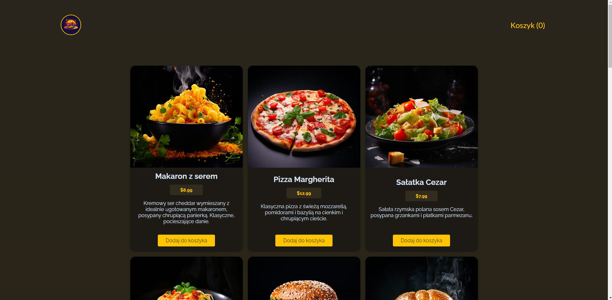
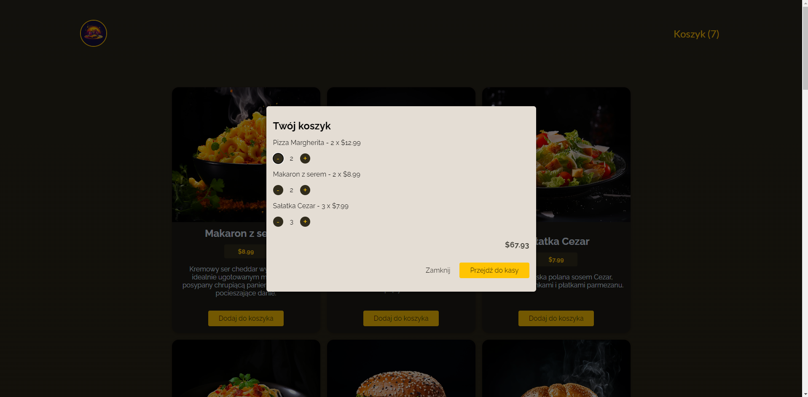
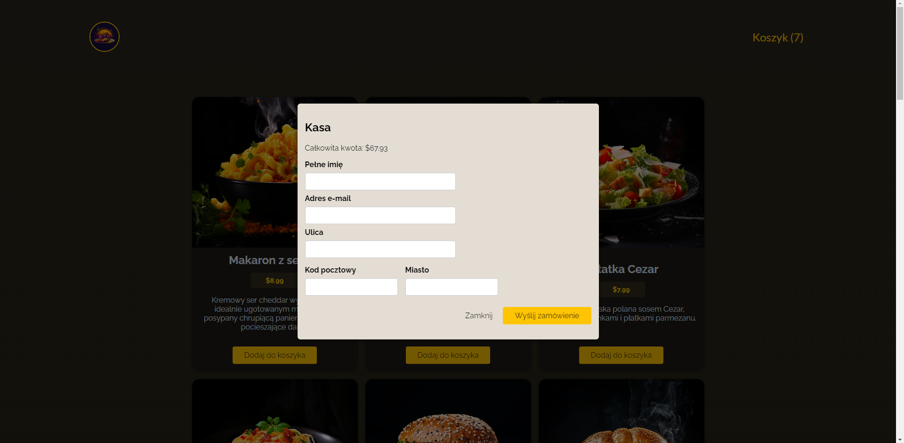
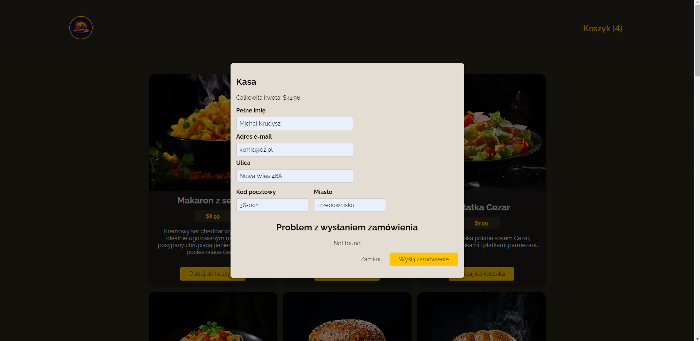
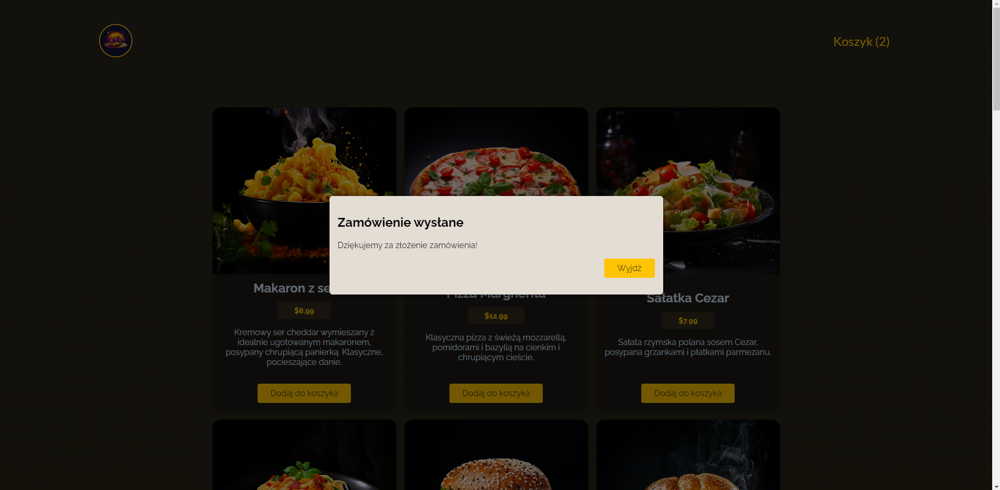

# Food Ordering Application

## Brief Description

The food ordering application allows browsing the menu, modifying the quantity of selected items, and placing orders. Product data, including images, descriptions, and prices, are retrieved from the backend. After filling out the contact information in the form, the order is sent to the backend system. The application includes error handling mechanisms for communication with the backend. The project was developed as part of a course to practice the basic concepts learned so far.

## Technologies

- React
- React hooks (useState, useContext, useEffect, useReducer, useCallback, useRef)
- ReactDOM (ReactDOM.createPortal)
- Context API
- Custom Hooks (useHttp)
- Form handling
- CSS

## Features

- **Data synchronization with the server**: The application automatically downloads current product positions along with full information about them, which are displayed on the main user interface.
- **Adding products to the cart**: Users have the option to add selected products to a virtual cart.
- **Cart management**: This feature allows users to view the contents of the cart, modify the quantity of individual products, and display the total price for selected items.
- **Order submission form**: After selecting products, the user can proceed to place an order by filling out a form containing personal and address information.
- **Sending the order to the server**: After verifying and approving the form, the application sends all information related to the order and user data to the backend for processing.

The backend code for the application was provided by the course instructor.

## App Screenshots

### Main Application Screen

### Displayed cart along with product information

### Form used for placing an order

### Example of error handling

### Confirmation of placing an order

## Pre-installation Requirements

A Node.js environment is required to run the application locally. To set up the project:

1. Clone the project repository.
2. Navigate to the project directory and run `npm install` to install dependencies.
3. Open a terminal window and execute `npm run dev` to start the frontend application in development mode.
4. Open another terminal window, navigate into the backend directory using `cd backend`, and then run `node app.js` to start the backend server.

This setup ensures that both the frontend and backend components of the application are running simultaneously on your local machine.
